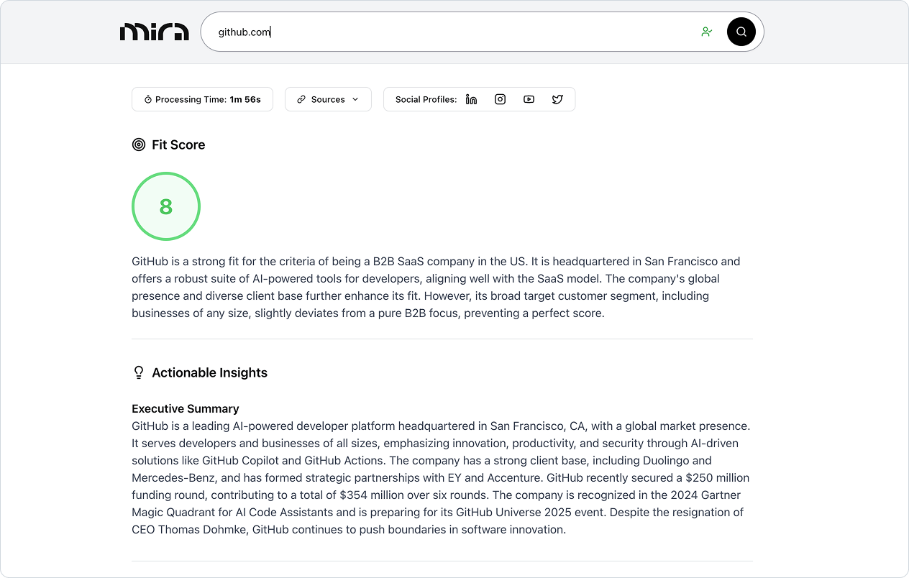
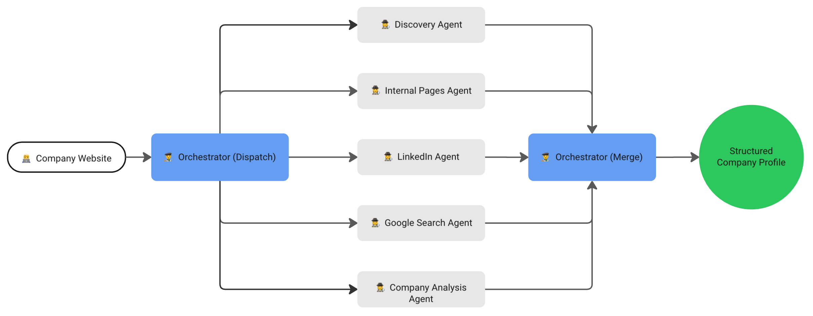

<p align="center">
  
</p>

<p align="center">Agentic AI System for Company Data Enrichment</p>

<div align="center">

[](LICENSE)
[](https://github.com/dimimikadze/mira/actions/workflows/ci.yml)
[](https://www.npmjs.com/package/mira-ai)
[](CONTRIBUTING.md)

</div>

<p align="center">
  <a href="https://www.youtube.com/watch?v=NPTLzECkBT8">
    
  </a>
</p>

# About Mira

Mira is an agentic AI system that automates company data enrichment with configurable data points and intelligent source selection. It gathers information from company websites, LinkedIn profiles, and Google Search, then assembles a structured profile with confidence scores and clear source attribution.

The system features smart early termination - once all configured data points reach high confidence scores, it automatically stops processing to save time and API costs. Sources are fully configurable, allowing you to enable or disable website crawling, LinkedIn analysis, and Google Search based on your needs.

The core of Mira is a framework-agnostic library that can be published as an npm package or integrated directly into your applications, pipelines, or custom workflows.

To show how it works in practice, this repository includes a complete Next.js frontend application that consumes the core library and provides a full interface with workspace management for running research and viewing results. For processing large datasets, a bulk enrichment tool is also included.

## Mira in action

<p align="center">
  
</p>

## Key Features

- **Configurable Data Points** – Define exactly what information to collect (company name, industry, funding, etc.) with custom descriptions for precise extraction.
- **Intelligent Source Selection** – Enable/disable website crawling, LinkedIn analysis, and Google Search based on your needs.
- **Smart Early Termination** – Automatically stops processing when all data points reach high confidence scores, saving time and API costs.
- **Multi-Agent Architecture** – Specialized agents handle discovery, internal pages, LinkedIn, Google Search, and analysis, with intelligent orchestration.
- **Confidence Scoring & Source Attribution** – Each fact includes a confidence score (1-5) and references its source for transparency and trust.
- **Company Analysis & Criteria Matching** – Generate executive summaries and evaluate companies against custom criteria with fit scores (0-10) and detailed reasoning.
- **Personalized Outreach Generation** – AI-powered LinkedIn and email outreach message creation based on enriched company data with customizable prompts.
- **Realtime Progress Events** – Emits structured events during execution so you can track and display live progress.
- **Service Layer for Data Gathering** – Built-in services handle scraping, Google Search, LinkedIn company data, and cookie consent banners.
- **Composable Core Library** – Framework-agnostic and publishable as an npm package, ready for Node.js/TypeScript projects.
- **Complete Next.js Frontend** – Full application showing how to consume the library with workspace management, user authentication, and live progress updates.
- **Bulk Processing** – Process large datasets with resume capability, concurrent processing, and automatic result export.

## How it works

Mira takes a company's website URL and your configuration, then intelligently orchestrates multiple AI agents to gather comprehensive company information. You can customize exactly what data to collect and which sources to use.

**Configuration**

- **Data Points**: Define custom data points with names and descriptions (e.g., "industry": "Primary business sector or market vertical")
- **Sources**: Enable/disable website crawling, LinkedIn analysis, and Google Search (landing page is always analyzed)
- **Analysis**: Optionally enable executive summary generation and/or provide company criteria for fit scoring

**Intelligent Orchestration**

1. **Discovery agent** analyzes the landing page, extracts social profiles, and identifies relevant internal pages
2. **Internal pages agent** (if enabled) scans discovered pages for data points that need improvement
3. **LinkedIn agent** (if enabled) gathers additional details, but only for missing or low-confidence data points
4. **Google Search agent** (if enabled) queries for remaining gaps using targeted searches
5. **Company analysis agent** (if configured) generates executive summary and/or evaluates company criteria fit

**Smart Early Termination**

The system continuously monitors data point confidence scores. If all configured data points reach the minimum confidence threshold, processing automatically terminates early to save time and API costs.

**Data Merging & Confidence**

- Every data point includes a confidence score (1-5) and source attribution
- When multiple sources provide the same information, higher confidence scores take precedence
- Real-time progress events are emitted throughout execution for live status tracking

## Architecture Diagram



## Tech Stack

### Core Library (`packages/mira-ai`)

- **Node.js** – runtime environment.
- **TypeScript** – type safety and maintainability.
- **OpenAI Agents SDK** – multi-agent orchestration and reasoning.
- **ScrapingBee** – API-based scraping, used for both website crawling and Google Search.
- **Zod** – runtime schema validation and input/output type enforcement.
- **Jest** – testing framework for validating services and agents individually.

### Frontend Application (`apps/mira-frontend`)

- **Next.js** – full-featured interface to run enrichment and display results.
- **Supabase** – user authentication and workspace storage.
- **Workspace Management** – create and manage multiple research configurations with custom data points, sources, and analysis settings.
- **TypeScript** – Consumes core library types.
- **TailwindCSS** – styling for the UI.
- **shadcn/ui** – accessible, prebuilt UI components.

### Bulk Processing (`apps/mira-bulk`)

- **Node.js** – standalone CLI for processing large datasets.
- **SQLite** – local progress tracking with resume capability.
- **PQueue** – concurrent processing with configurable parallelism.

## Requirements

- **Node.js** v18 or later (ensures compatibility with the OpenAI Agents SDK)
- **npm** (comes with Node.js) or **pnpm/yarn** as your package manager
- **API Keys**:
  - `OPENAI_API_KEY` — for agent orchestration
  - `SCRAPING_BEE_API_KEY` — for web scraping and Google Search
- **Supabase Account** (for frontend) — user authentication and workspace storage

## Environment Variables

Mira requires API keys to function. Environment files are used to separate configuration for local development and testing.

### Core Library Testing (`packages/mira-ai/.env.test`)

For testing the core library, create a `.env.test` file:

```
OPENAI_API_KEY=sk-xxxx
SCRAPING_BEE_API_KEY=xxxx
```

### Frontend (`apps/mira-frontend/.env.local`)

For running the frontend, create a `.env.local` file with additional Supabase configuration:

```
OPENAI_API_KEY=sk-xxxx
SCRAPING_BEE_API_KEY=xxxx

NEXT_PUBLIC_SUPABASE_URL=your-supabase-url
NEXT_PUBLIC_SUPABASE_ANON_KEY=your-supabase-anon-key
```

## Installation & Setup

You can use Mira in three ways:

1. **Local Development** (run the frontend application with workspaces and the core library)
2. **As an npm Package** (use the mira-ai library directly in your own project)
3. **Bulk Processing** (process large datasets via CLI)

---

### 1. Local Development

Clone the repository and install dependencies:

```bash
git clone https://github.com/dimimikadze/mira.git
cd mira
npm install
```

#### Frontend Setup

Create `apps/mira-frontend/.env.local` with your API keys and Supabase configuration:

```bash
OPENAI_API_KEY=sk-xxxx
SCRAPING_BEE_API_KEY=xxxx

# Supabase
NEXT_PUBLIC_SUPABASE_URL=your-supabase-url
NEXT_PUBLIC_SUPABASE_ANON_KEY=your-supabase-anon-key
```

Run database migrations:

```bash
npm run db:migrate
```

Generate TypeScript types from your Supabase schema:

```bash
npm run generate-types
```

Start the frontend application:

```bash
npm run dev:mira-frontend
```

### 2. Use as an npm package (mira-ai library)

```bash
npm install mira-ai
```

```typescript
import { researchCompany } from 'mira-ai';

const config = {
  apiKeys: {
    openaiApiKey: process.env.OPENAI_API_KEY!,
    scrapingBeeApiKey: process.env.SCRAPING_BEE_API_KEY!,
  },
};

const result = await researchCompany('https://company.com', config, {
  enrichmentConfig: {
    // Define custom data points to collect
    dataPoints: [
      { name: 'industry', description: 'Primary business sector' },
      { name: 'employeeCount', description: 'Number of employees' },
      { name: 'funding', description: 'Latest funding round and amount' },
      { name: 'recentNews', description: 'Recent company news or updates' },
    ],
    // Configure which sources to use (landing page is always analyzed)
    sources: {
      crawl: true, // Enable internal pages crawling
      linkedin: true, // Enable LinkedIn analysis
      google: true, // Enable Google Search
    },
    // Configure analysis options
    analysis: {
      executiveSummary: true, // Generate executive summary
      companyCriteria: 'B2B SaaS companies with 50-200 employees', // Evaluate fit against criteria
    },
  },
  onProgress: (type, message) => {
    console.log(`${type}: ${message}`);
  },
});

console.log(result.enrichedCompany);
console.log(result.companyAnalysis);
```

### 3. Bulk Processing

For processing large datasets, use the bulk enrichment tool. It reads from a CSV, processes companies with configurable concurrency, saves progress to SQLite for resume capability, and exports results to Supabase storage.

See [Mira Bulk README](./apps/mira-bulk/README.md) for setup and deployment instructions.

### Authentication

The frontend application uses Supabase for user authentication and workspace management. Users can sign up and sign in through the Supabase Auth system, with each user having access to their own private workspaces.

## Additional Documentation

This monorepo contains three main packages, each with its own README:

- **[Mira AI Library](./packages/mira-ai/README.md)** — Node.js/TypeScript library with agents, services, and orchestration logic.
- **[Mira Frontend](./apps/mira-frontend/README.md)** — Next.js application with workspace management for running enrichment and visualizing results.
- **[Mira Bulk](./apps/mira-bulk/README.md)** — CLI tool for bulk company enrichment with resume capability.

## AI-Assisted Development

If you're developing with AI tools like Cursor, configuration rules are already set up in the root, library, and frontend packages to ensure consistency.

## Contributing

See [CONTRIBUTING.md](./CONTRIBUTING.md) for guidelines.

## License

Distributed under the MIT License. See [LICENSE](./LICENSE) for details.

## Credits

Logo and UI design by [salomeskv](https://www.salomeskv.com/about)
